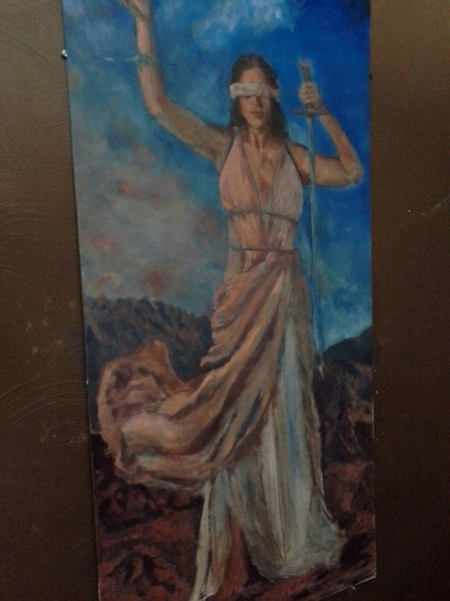

# MuralPanels
Just creating a simple way to record the progress of my mural panels...

## Step one

Initial drawing, right there on the panel.  This is a 2 foot by 4 foot charcoal drawing on an acrylic primed and clear gesso'ed luan plywood panel I had sitting in my back yard.. I'm using various bits of reference.  I'm still not totally sure what I want to do, but I'm thinking it should be fun to figure it out.

## Step two

I was unhappy with the original dress and too rigidly boxy pose, and I have to figure out what I'm going to do with all the rest of that board.  Initially I was thinking it would be dark, but I now I felt like it is going to be strange to have this body just floating there.  Someone on twitter suggested standing on a rock or something, which made me think that maybe she should be on a mountain, or near some mountains.  Up high.  Themis was a Delphic Oracle, so why not.  I made her a and her dress a little less boxy and after consulting about a million kinds of reference and drawing/erasing a bunch of options, decided to kind of loosely base it off of one of Queen Gorgo's outfits, and sketch in some mountains in the back ground and maybe some uneven rocks she's standing on.

## Step three

The greatest enemy is a white canvas in my experience - you just cant make any kinds of judgements soundly as long as you have a lot of bare canvas.  When you first lay down a color on white canvas, it can look shockingly colorful and intense against the white. At some point you have to start making judgements about darkest darks, color schemes etc - figured I might as well jump right in and start laying paint on there.  Another reason to jump in early is that I don't know how well sealed this surface is and each bit of paint helps create a seal for laying the next layer on.  I'm mostly concerned with just major groups of things and a general scheme here.  Do I want the sky more blue or more sunsety, or even twilight.  I'm not sure.  I'm going to start with a fairly intense blue at the top and tone it into the distance - I feel like if I don't like this I can bump it one way or another later, but the only way to know is to start to see it come together and get some sense of what the skin and light should really look like, and how the shadows will flesh out.  I decide to define the face more, thin it out and change up the neck, shoulders and hair a bit. I scrub some of the sky color into bits of the dress as well, I'll eventually paint over this but it can help me determine how I want the fabric to be, warmer or cooler, etc - and having some reflected light is always desirable either way.

## Step four

Ok, I really want to get the definition of the upper parts and body to a spot that I am fairly happy with in terms of major bits.  I want to kind of know what is skin, what is cloth, what is sword handle, etc... I also scrub in more color in some shadows, though it's hard to tell here, and a bit in the sky and bottom... I'm still very unsure about what's gonna happen in the background..

## Step five

I've finally had to hang it on the wall in order to reach it all. Decide to try some rocky mountains set at several disances and a very rocky foreground.  Also experimenting with various cloud-forms and colors.  The painting is now up high and not easily moved and wet, so I've had to take to shooting in from the side to kill some of the glare.  Still, the left middle is seriously over-shined and washed out here- the reddish-yellow tinged clouds are actually quite nice in person and her skin not so intense, nor wite on the arm.  I think I will probably keep all of these clouds, where they are, but begin to push puts of them 'back' and restore a little of the blue I'm fairly happy with the first cut at the mountains in the distance - the rocks in the foreground still need some figuring out, but I like the (not well represented here) depth of blues, purples and oranges in the shadows of the rocks... I'll figure it out eventually :)  

## Step six

Ok so the only thing that isn't nicely covered with _some_ color at least and where it is still just very hand-wavey is that outfit.  To be honest, I can't decide whether it should be a cool color or a warm one.  Further, I have no idea how this fabric should go... I'm making most of this out of my head at this point.  Decide to try a substantial chunk of it in warm from the side the light seems to want to be and see if I can get some folds and bumps in there that help it be more convincing as fabric on a body or blowing/hanging in the air Maxfield Parrish style.

